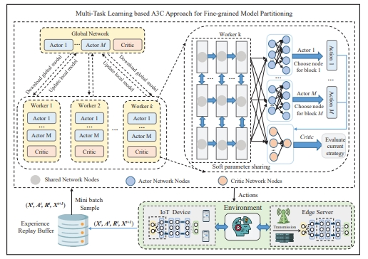

<!-- BEGIN VISITOR COUNTER 
-->
<!-- END VISITOR COUNTER -->
Hi! U are the -*th* visitor

  <h2> ✨  研究方向: </h2>
  <ul>
    <li>边云-模型分割</li>
    <li>边云-内容缓存</li>
    <li>边云-缺陷检测</li>
    <li>强化学习</li>
</ul>
  <strong>🌱 个人网站: </strong>
    <a href="https://ThreadLocal.github.io" target="_blank" style="text-decoration: none; font-weight: bold; color: inherit;"> https://ThreadLocal.github.io</a>    

<h2> 🌟  Staring & Language </h2>
 
<!--star数量-->

   
  

<h2> 🕒  Recent Research </h2>

 

  <strong>1.Distributed DNN Inference with Fine-grained Model Partitioning in Mobile Edge Computing Networks</strong>  
  <strong>Hui Li*</strong>, Xiuhua Li, Qilin Fan and Qiang He, Xiaofei Wang, and Victor C. M. Leung  

  <ul>
    <li>We present a fine-grained model partitioning mechanism that supports distributed DNN inference with the collaboration of ESs and IoT devices, for significantly reducing the DNN inference delay with specific delay constraints. We formulate the optimization problem as a Markov Decision Process (MDP) with the objective to maximize the long-term discounted cumulative reward of distributed DNN inference.</li>
    <li>We propose a novel multi-task learning based A3C approach to search for an appropriate fine-grained model partitioning policy. Specifically, we employ soft parameter sharing to integrate the shared layers
of both the actor-network and critic-network, and expand the output layer into multiple branches to determine the fine-grained model partitioning policy for each individual DNN block. It can significantly reduce the action space of DRL agents, thereby reducing the training time of the proposed approach. </li>
    <li>We evaluate the performance of the proposed approach through extensive experiments conducted on widely-used datasets in MEC networks. Simulation results show that the proposed approach can significantly reduce the total inference delay, edge inference delay and local inference delay. </li>
  </ul>

<h2>🧑‍💻  Technology Stack</h2> 
 
 
   
   
   
   
   
   
   
   
   
    

  

